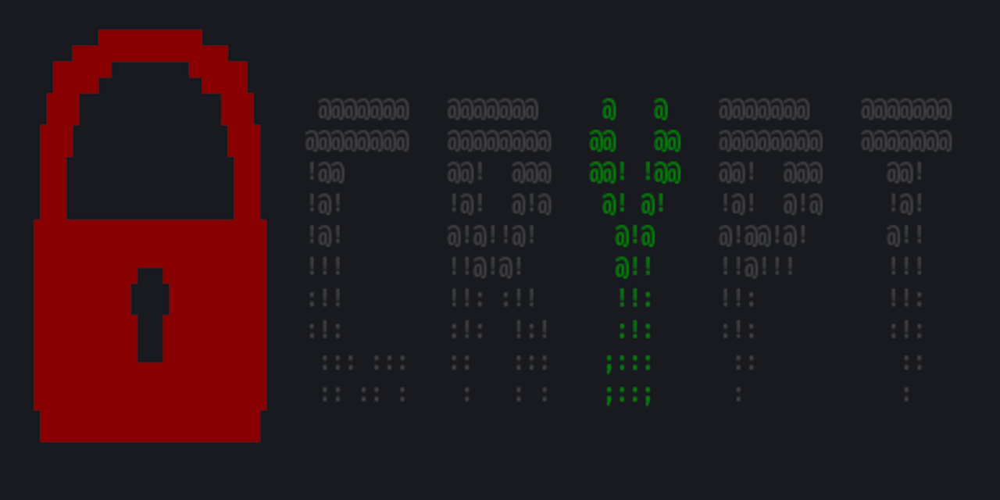

  
  

# CRYPT
**Encryption/Decryption Tool**

CRYPT is a tool that allows you to encrypt or decrypt texts.  

## Encodings:
* Base16
* Base32
* Base64
* Base85

## Ciphers:
* Caesar Cipher
* Morse Code
* Baconian Cipher
* Vigenère Cipher

## Hashes:
+ MD5
+ Md5 Crypt
+ Salted MD5
+ SHA256 & SHA512
+ SHA256 & SHA512 Crypt
+ Salted SHA256 & SHA512
+ NT
+ BCrypt
+ Argon2
+ PBKDF2+SHA256 & PBKDF2+SHA512
+ Hash Cracking with a wordlist or by Bruteforcing

---

## CryptB
This script takes a file as input and encodes/decodes it line by line and writes the lines to the output file.
